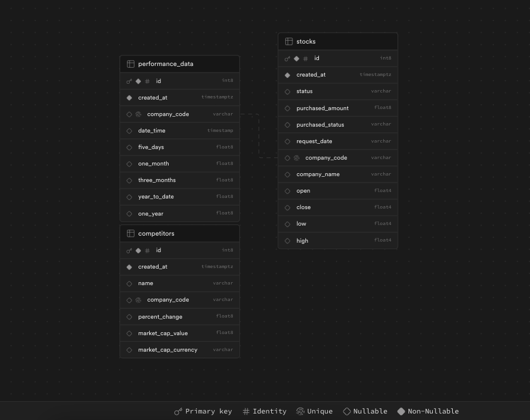

<div align="center">
  
</div>


## Stock api Overview

Stock API is a RESTful service that allows users to retrieve and update stock information. It fetches stock data from external financial APIs, performs data scraping from MarketWatch, and stores data in a Supabase database. This project is designed to be user-friendly and robust, making it easy for users to access and update stock information. 

## Features

- Fetch stock data for a given symbol and date from Polygon.io.
- Scrape performance and competitor data from MarketWatch.
- Persist stock data, performance data, and competitor data into Supabase-hosted PostgreSQL.
- Update stock purchase amount with data validation.
- Uses LRU cache set to 100 to optimse response latency as well as db IO. 
- Test coverage for endpoints and functions.
- Dockerfile that builds an image containing the ready-to-run API on port 8000
- Logging with python default logger optmized for log-searching.

## Endpoints

- **GET /stock/{stock_symbol}**: Fetch stock data for the given symbol. Defaults to yesterday if no date is provided.
- **GET /stock/{stock_symbol}/{date}**: Fetch stock data for the given symbol on the specified date.

```json
{
    "status": "String",
    "purchased_amount": "Integer",
    "purchased_status": "String",
    "request_date": "Date (YYYY-MM-DD)",
    "company_code": "String",
    "company_name": "String",
    "stock_values": {
        "open": "Float",
        "high": "Float",
        "low": "Float",
        "close": "Float"
    },
    "performance_data": {
        "five_days": "Float",
        "one_month": "Float",
        "three_months": "Float",
        "year_to_date": "Float",
        "one_year": "Float"
    },
    "competitors": [
        {
            "name": "String",
            "company_code": "String",
            "percent_change": "Float",
            "market_cap": {
                "currency": "String",
                "value": "Float"
            }
        }
    ]
}
```


- **POST /stock/{stock_symbol}**: Update the stock entity with the purchased amount based on the received argument.

```json
{
	"message": "9999 units of stock meta were added to your stock record"
}
```
## Usage

### Environment Variables

- `SUPABASE_URL`: URL for the Supabase database.
- `SUPABASE_KEY`: URL for the Supabase service that wraps the db.
- `POLYGON_API_KEY`: API key for Polygon.io.
- `POLYGON_BASE_URL`: Base URL for Polygon.io.
- `ZENROW_API_KEY`: API key for ZenRows.

### Dependencies

- `Flask`: Web framework.
- `requests`: HTTP library for Python.
- `BeautifulSoup`: Library for web scraping.
- `Supabase`: Client for interacting with Supabase.
- `dotenv`: Library to load environment variables.
- `pytest`: Testing framework for Python.


Ensure you have all the env variables set corretly as the env example shows. Supabase will require you to create the models there, follow this modelling if you need for the basic functionality to be enabled. 

<div align="center">
  
</div>

### Build the Docker image
```bash
docker build -t stock_api .
```
### Run the Docker container
```bash
docker run -p 8000:8000 stock_api
```

### Running tests 

```bash
pytest
```
